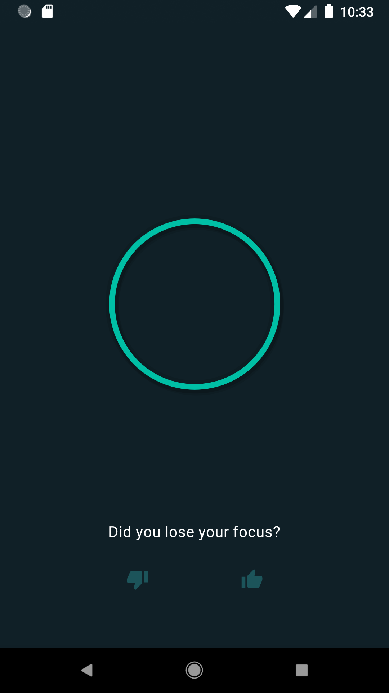

# Closed-loop Meditation

A meditation timer with a very simple feedback loop.

The idea was originally described in:

> Ziegler et al.
> Closed-loop digital meditation improves sustained attention in young adults. *Nat Hum Behav 3*, 746–757 (2019).
> https://doi.org/10.1038/s41562-019-0611-9

##### Screenshots

  
